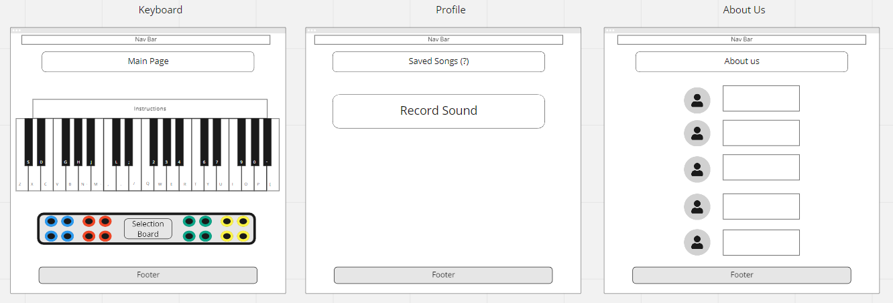
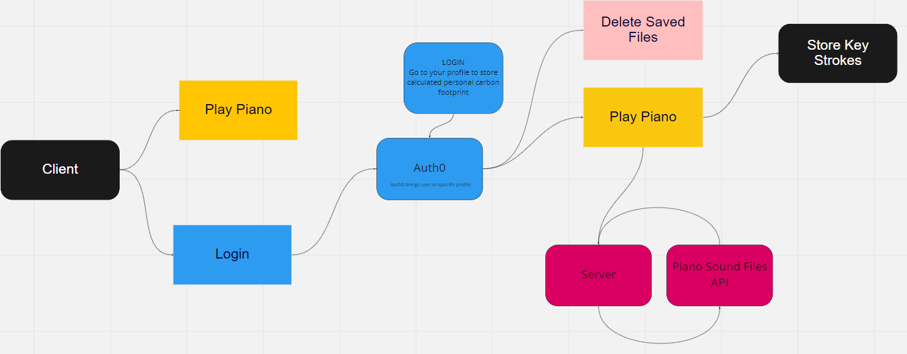
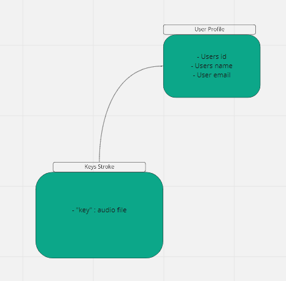

# Piano Keys ***(App title TBD)***  

## Meet team KBRAT

**Kyle Cohen**  
**Brandon Rimes**  
**Ryan Emmans**  
**Alex Grazda**  
**Tray Chea**  

- Idea for team KBRAT is to create an application so that a user can input a keyboard keystroke that cooresponds with a piano on the app. When key is pressed, a sound will be played.

- The pain point is giving users the opportunity to have an interactive experiance and provide musical feedback. Users will be able to save what they have created.

- MVP will be having a keyboard that is visual on the page and produces sounds when useing keystrokes

- Stretch goals add additional librarys and instruments.

## Wireframe  

## DOM  

## Schema  

  

## User Stories  

### User Story #1  

1. **Title:** Login Not Required  
2. **User Story sentence:** As a user I would like to access a keyboard on the home page without having to log in to a profile so that I can play/test keystrokes.  
3. **Feature Tasks:** User can play keys without logging in  
4. **Acceptance Tests:** No prompt will show when user enters app  

### User Story #2  

1. **Title:** Play piano sounds from my keyboard  
2. **User Story sentence:** As a user I would like to play tunes from my keyboard as it corresponds to the piano key on the app  
3. **Feature Tasks:** Press an assigned letter or symbol to create a specific sound on the app  
4. **Acceptance Tests:** When assigned key is pressed a sound will be played.  

### User Story #3  

1. **Title:** Store my Key Stroke Sequence
2. **User Story sentence:** As a user I want to be able to same my key input so that I may access them at a later time
3. **Feature Tasks:** Store keystroke sequence and file in data base under user profile.
4. **Acceptance Tests:** Enter User profile and open saved sequence file and play back

### User Story #4

1. **Title:** Adding personal to the database  
2. **User Story sentence:** As a user I would like save my own sound library and share them with other users  
3. **Feature Tasks:** User can upload or record sounds into database and be able to access them later, or a seperate user access those sounds in a library  
4. **Acceptance Tests:** Ensure downloads are saved to data base and can be accessed  

### User Story #5

1. **Title:** Update/Delete Sequence Name
2. **User Story sentence:** As a user I would like to have the ability to Change the name of my sequence of sound or delete the file if I no longer want it
3. **Feature Tasks:** Access file and change file name - Delete file from user profile
4. **Acceptance Tests:** File accepts name change - File permnnantly deleted from user profile
